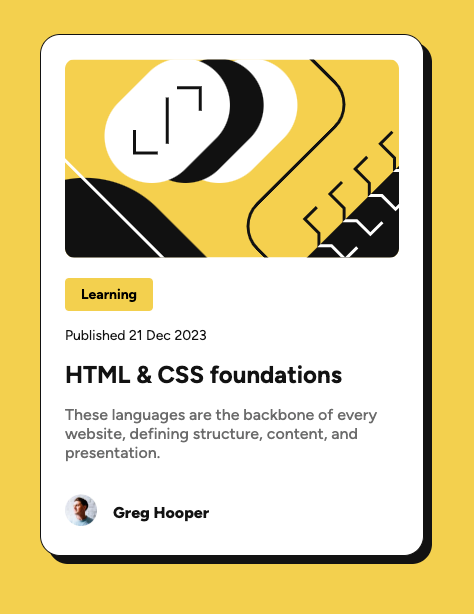

# Frontend Mentor - Blog preview card solution

This is a solution to the [Blog preview card challenge on Frontend Mentor](https://www.frontendmentor.io/challenges/blog-preview-card-ckPaj01IcS). Frontend Mentor challenges help you improve your coding skills by building realistic projects.

## Table of contents

- [Overview](#overview)
  - [The challenge](#the-challenge)
  - [Screenshot](#screenshot)
  - [Links](#links)
- [My process](#my-process)
  - [Built with](#built-with)
  - [What I learned](#what-i-learned)
  - [Continued development](#continued-development)
  - [Useful resources](#useful-resources)
- [Author](#author)

## Overview

### The challenge

Users should be able to:

- See hover and focus states for all interactive elements on the page

### Screenshot

### Links

- Live Site URL: [Add live site URL here](https://your-live-site-url.com](https://stellular-figolla-320253.netlify.app/)

## My process

### Built with

- Semantic HTML5 markup
- CSS custom properties
- Flexbox
- CSS Grid

### What I learned

I am getting better at understanding some of the basic HTML and CSS practices to go a beyond just getting a solution and being able to have a plan for how to approach a project. I have a better idea of how to approach creating and styling a basic UI element like a card using a more structured and methodical approach to the code.

### Continued development

I still struggle with understanding all of the CSS properties and how they could be used to make the stylesheet more standardized and reusable. I have a basic idea of responsive design, but it's mainly around the sizing of elements and layout like changing from flex row to column at a particular breakpoint. Changing the typograpy is something I think will take more time and practice. I didn't really take advantage of Flexbox or CSS grid in this project as it seemed like it would be easy enough without it, but I would like to try the layout again with these methods.

### Useful resources

- [box shadow](https://developer.mozilla.org/en-US/docs/Web/CSS/box-shadow) - I was struggling to get the box shadow looking right, so I had to refresh my memory of all of the different inputs and forms of this property.

## Author

- Frontend Mentor - [@emil-raubach](https://www.frontendmentor.io/profile/emil-raubach)
- Twitter - [@EmilRaubach](https://www.x.com/EmilRaubach)
