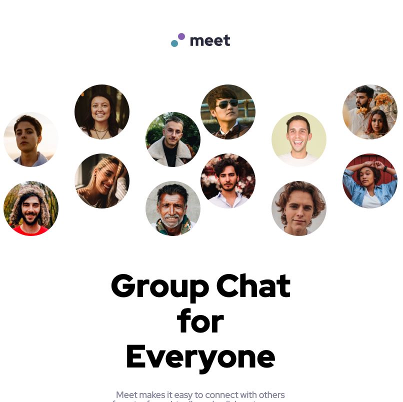

# Frontend Mentor - Meet landing page solution

This is a solution to the [Meet landing page challenge on Frontend Mentor](https://www.frontendmentor.io/challenges/meet-landing-page-rbTDS6OUR). Frontend Mentor challenges help you improve your coding skills by building realistic projects.

## Table of contents

- [Overview](#overview)
  - [The challenge](#the-challenge)
  - [Screenshot](#screenshot)
  - [Links](#links)
- [My process](#my-process)
  - [Built with](#built-with)
  - [Continued development](#continued-development)
- [Author](#author)

## Overview

### The challenge

Users should be able to:

- View the optimal layout depending on their device's screen size
- See hover states for interactive elements

### Screenshot

### Links

- Live Site URL: [Live Site on Netlify](https://charming-phoenix-a2195f.netlify.app/)

## My process

### Built with

- Semantic HTML5 markup
- CSS custom properties
- Flexbox
- CSS Grid
- BEM
- Sass

### Continued development

I need to keep learning how to layout a website using Flexbox and CSS Grid while keeping it responsive. I had a hard time with this challenge for some reason even though it's not too complicated. I tried using Sass for this project, and it may have added to much additional complexity at this point versus regular CSS.

## Author

- Frontend Mentor - [@emil-raubach](https://www.frontendmentor.io/profile/emil-raubach)
- Twitter - [@EmilRaubach](https://www.twitter.com/EmilRaubach)
