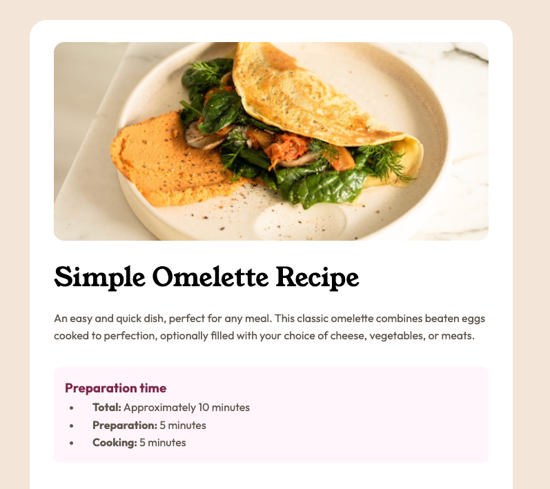

# Frontend Mentor - Recipe page solution

This is a solution to the [Recipe page challenge on Frontend Mentor](https://www.frontendmentor.io/challenges/recipe-page-KiTsR8QQKm). Frontend Mentor challenges help you improve your coding skills by building realistic projects.

## Table of contents

- [Overview](#overview)
  - [The challenge](#the-challenge)
  - [Screenshot](#screenshot)
  - [Links](#links)
- [My process](#my-process)
  - [Built with](#built-with)
  - [What I learned](#what-i-learned)
  - [Continued development](#continued-development)
  - [Useful resources](#useful-resources)
- [Author](#author)

## Overview

### Screenshot



### Links

- Live Site URL: [Recipe Page Site](https://subtle-fudge-cfb395.netlify.app/)

## My process

### Built with

- Semantic HTML5 markup
- CSS custom properties
- Flexbox

### What I learned

I ran into a few challenges on this exercise, which is a great learning opportunity! One thing I got caught-up on for a while was styling tables, something I don't have much experience with doing manually (I have used Bootstrap in the past which makes it pretty easy). The main hang-up I had was implementing the bottom border of the table rows except the last one. I was trying to target the `tr` which doesn't work as I expected. I found that to add bottom border to the `tr` rather than each `td` I needed to set the `border-collapse` property of the table to `collapse` (the default is `separate`). The code I used is below:

```css
.nutrition__table {
  width: 100%;
  padding-bottom: 1rem;
  border-collapse: collapse;
}

.nutrition__table .nutrition__table-row:not(:last-child) {
  border-bottom: 1px solid var(--clr-stone-150);
}
```

### Continued development

- I still struggle to know if the HTML layout I'm choosing is optimal (if there is such a thing).
- Using best practices for my CSS to make my styles more component based / standardized.
- Mastering Flexbox and CSS Grid
- Keep learning responsive design and work towards the so-called "mobile-first" design.
- Learning how to utilize the browser dev tools better.
- Improving at typesetting and managing fonts

### Useful resources

- [Giving a border to an HTML table row on Stackoverflow](https://stackoverflow.com/questions/20872200/giving-a-border-to-an-html-table-row-tr) - Helped me figure out how to target the `tr` to add borders to table rows.

## Author

- Frontend Mentor - [@emil-raubach](https://www.frontendmentor.io/profile/emil-raubach)
- Twitter - [@EmilRaubach](https://www.twitter.com/EmilRaubach)
