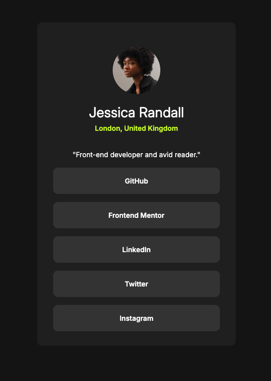

# Frontend Mentor - Social links profile solution

This is a solution to the [Social links profile challenge on Frontend Mentor](https://www.frontendmentor.io/challenges/social-links-profile-UG32l9m6dQ). Frontend Mentor challenges help you improve your coding skills by building realistic projects.

## Table of contents

- [Overview](#overview)
  - [The challenge](#the-challenge)
  - [Screenshot](#screenshot)
  - [Links](#links)
- [My process](#my-process)
  - [Built with](#built-with)
  - [Continued development](#continued-development)
  - [Useful resources](#useful-resources)
- [Author](#author)

## Overview

### The challenge

Users should be able to:

- See hover and focus states for all interactive elements on the page

### Screenshot

### Links

- Live Site URL: [Social Links Profile](https://illustrious-bublanina-cb6473.netlify.app/)

## My process

### Built with

- Semantic HTML5 markup
- CSS custom properties
- Flexbox

### Continued development

Some takeaways from this challenge is to start to have my own workflow and method for tackling the layout and styling of a website. Things like "boilerplate" code for resets, how I use CSS variables to create more resusable styles, etc. I also need to keep improving on responsive design and look into how to approach it from the so-called "mobile first" perspective.

### Useful resources

- [Responsive Layouts the Easy Way](https://youtu.be/VQraviuwbzU?si=36o_WL8Q7HcsMQ15) - A few good general tips for responsive web design.

## Author

- Frontend Mentor - [@emil-raubach](https://www.frontendmentor.io/profile/emil-raubach)
- Twitter - [@EmilRaubach](https://www.twitter.com/EmilRaubach)
